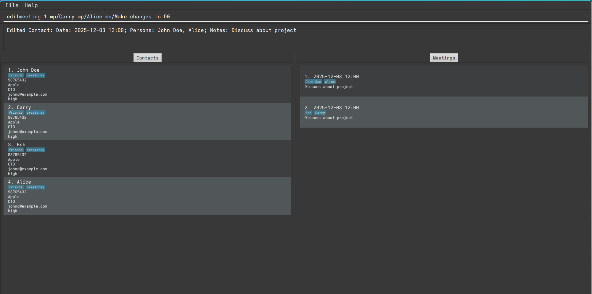

<h1 align="center">
   
  InternHive
   
</h1>

## What is InternHive?
* A hub for managing internships efficiently
* Targeted for students looking for internships

## Credits
* This project is based on the AddressBook-Level3 project created by the [SE-EDU initiative](https://se-education.org).