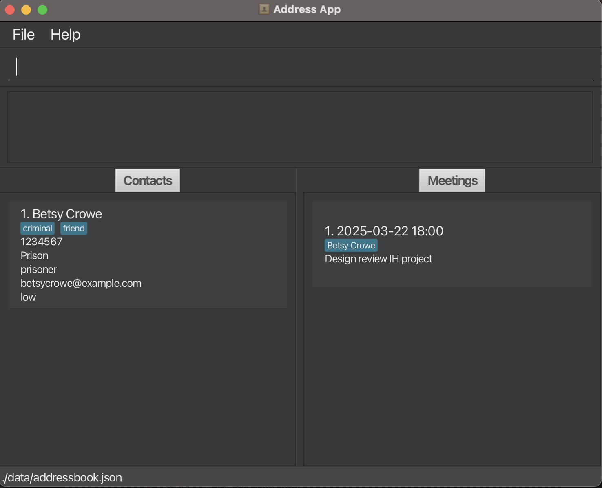

InternHive (IH) is a **desktop app targeting students for managing your industry contacts, optimized for use via a Command Line Interface** (CLI) while still having the benefits of a Graphical User Interface (GUI). If you can type fast, InternHive can get your contact management tasks done faster than traditional GUI apps.

* Table of Contents
{:toc}

--------------------------------------------------------------------------------------------------------------------

## Quick start

1. Ensure you have Java `17` or above installed in your Computer. 
   **Mac users:** Ensure you have the precise JDK version prescribed [here](https://se-education.org/guides/tutorials/javaInstallationMac.html).

1. Download the latest `.jar` file from [here](https://github.com/se-edu/addressbook-level3/releases).

1. Copy the file to the folder you want to use as the _home folder_ for your AddressBook.

1. Open a command terminal, `cd` into the folder you put the jar file in, and use the `java -jar InternHive.jar` command to run the application. 
   A GUI similar to the below should appear in a few seconds. Note how the app contains some sample data. 
   

1. Type the command in the command box and press Enter to execute it. e.g. typing **`help`** and pressing Enter will open the help window. 
   Some example commands you can try:

   * `list` : Lists all contacts.

   * `add n/John Doe e/johnd@example.com p/98765432 c/Apple j/Software Engineer i/High` : Adds a contact named `John Doe` to the Address Book.

   * `delete 3` : Deletes the 3rd contact shown in the current list.

   * `clear` : Deletes all contacts.

   * `exit` : Exits the app.

1. Refer to the [Features](#features) below for details of each command.

--------------------------------------------------------------------------------------------------------------------

## Features

**:information_source: Notes about the command format:** 

* Words in `UPPER_CASE` are the parameters to be supplied by the user. 
  e.g. in `add n/NAME`, `NAME` is a parameter which can be used as `add n/John Doe`.

* Items in square brackets are optional. 
  e.g `n/NAME [t/TAG]` can be used as `n/John Doe t/friend` or as `n/John Doe`.

* Items with `…`​ after them can be used multiple times including zero times. 
  e.g. `[t/TAG]…​` can be used as ` ` (i.e. 0 times), `t/friend`, `t/friend t/family` etc.

* Parameters can be in any order. 
  e.g. if the command specifies `n/NAME p/PHONE_NUMBER`, `p/PHONE_NUMBER n/NAME` is also acceptable.

* Extraneous parameters for commands that do not take in parameters (such as `help`, `list`, `exit` and `clear`) will be ignored. 
  e.g. if the command specifies `help 123`, it will be interpreted as `help`.

* If you are using a PDF version of this document, be careful when copying and pasting commands that span multiple lines as space characters surrounding line-breaks may be omitted when copied over to the application.

### Viewing help : `help`

Opens a seperate window to show a snippet of the user guide detailing all the available commands, format and example usage.

Format: `help`

### Adding a contact: `add`

Adds a contact to the address book.

Format: `add n/NAME e/EMAIL p/PHONE_NUMBER c/COMPANY j/POSITION [t/TAG]…​ i/IMPORTANCE`

:bulb: **Tip:**
Duplicate names (case-insensitive) are not allowed.  
A contact can have any number of tags (including 0).  
Special tags: hiring - indicates that the contact is open to hiring;  
**IMPORTANCE** Field can only be one of the following: High, Medium, Low

Examples:
* `add n/John Doe e/johnd@example.com p/98765432 c/Apple j/Software Engineer i/High`
* `add n/Betsy Crowe t/friend e/betsycrowe@example.com c/Google j/Software Designer p/1234567 t/criminal i/Low`

### Listing all contacts : `list`

Shows a list of all contacts in the address book.

Format: `list`

### Editing a contacts : `edit`

Edits an existing contacts in the address book.

Format: `edit INDEX [n/NAME] [p/PHONE] [e/EMAIL] [a/ADDRESS] [t/TAG]…​ [i/IMPORTANCE]`

* Edits the contact at the specified `INDEX`. The index refers to the index number shown in the displayed contact list. The index **must be a positive integer** 1, 2, 3, …​
* At least one of the optional fields must be provided.
* Existing values will be updated to the input values.
* When editing tags, the existing tags of the contact will be removed i.e adding of tags is not cumulative.
* You can remove all the contact’s tags by typing `t/` without
    specifying any tags after it.

Examples:
*  `edit 1 p/91234567 e/johndoe@example.com` Edits the phone number and email address of the 1st contact to be `91234567` and `johndoe@example.com` respectively.
*  `edit 2 n/Betsy Crower t/` Edits the name of the 2nd contact to be `Betsy Crower` and clears all existing tags.

### Locating contacts by name: `find`

Finds Contacts whose names contain any of the given keywords.

Format: `find KEYWORD [MORE_KEYWORDS] [c/COMPANY]`

* The search is case-insensitive. e.g `hans` will match `Hans`.
* The order of the keywords matters. e.g. `Hans Bo` will not match `Bo Hans`.
* Only the name is searched if no other options are provided.
* Command will use Partial Search.
* Only Contacts matching with the full keyword will be returned.
  e.g. `Hans Bo` will return `Hans Bother`, `Hans Bo` and not `Hans Gruber`, `Bo Yang`.
* If the Company Parameter is provided, it will search for a contact that matches **BOTH** the `KEYWORD` provided and the `COMPANY` Provided.

Examples:
* `find John` returns `john` and `John Doe`.
* `find alex david` returns `Alex David`, `Alex Davidson`. 
* `find alex david c\Google` returns `Alex Davidson` that works at `Google`. 
<!-- TODO: Add the picture for the find command -->

### Filtering contacts by tags: `filter`

Finds Contacts with tags containing the search term.

Format: `filter SEARCHTERM`

* The search is case-insensitive. e.g `Friend` will match `friend`.
* Only the exact search term is searched. e.g. `Hiring Friend` will not match `Hiring`.
* Command will use Partial Search.
* Only contacts with tags matching with the full keyword will be returned.
  e.g. `Fri` will return `Friend`, `Fridge` and not `Frail`, `Fragile`.

Examples:
* `filter hiring` returns `John` and `John Doe` if John and John Doe both have `hiring` tags.
<!-- TODO: Add the picture for the filter command -->

### Sort Contact List: `sort`

Sorts Contacts in the AddressBook in ascending or descending order.

Format: `sort SORT_TERM ORDER`

* The sort-term is case-sensitive. E.g `importance` will not match `Importance`.
* Only 2 Current `SORT_TERM` is supported:
  * `name`  
  * `importance` 
* Only 2 ways to specify `ORDER`:
  * `asc` : Sorts Contacts in Ascending Order
  * `desc` : Sorts Contacts in Descending Order

Examples:
* `sort importance desc` returns contact list from the highest importance level to the lowest importance level.

### Deleting a contact : `delete`

Deletes the specified contact from the address book.

Format: `delete INDEX`

* Deletes the contact at the specified `INDEX`.
* The index refers to the index number shown in the displayed contact list.
* The index **must be a positive integer** 1, 2, 3, …​

Examples:
* `list` followed by `delete 2` deletes the 2nd contact in the address book.
* `find Betsy` followed by `delete 1` deletes the 1st contact in the results of the `find` command.

### Add a meeting : `addmeeting`

Adds a new meeting to the address book.

Format: `addmeeting dt/DATETIME mp/CONTACT_NAME... [mn/NOTES]`

* Adds a new meeting at `DATETIME` with `CONTACT_NAME`(s).
* Multiple people can be at a meeting by specifying multiple people `mp/Alice mp/Bob`.
* `CONTACT_NAME` must exist as a contact in the addressbook.
* `NOTES` is not a required field and can be omited or left blank.
* New meetings cannot have the same `DATETIME` with the same `CONTACT_NAME`.

* `DATETIME` can only be in the following formats:  
  * yyyy-MM-dd HH:mm (e.g., 2024-04-01 14:30)
  * dd/MM/yyyy HH:mm (e.g., 01/04/2024 14:30)
  * MM/dd/yyyy HH:mm (e.g., 04/01/2024 14:30)

Examples:
* `addmeeting dt/2025-03-21 06:00 mp/Irfan Ibrahim mn/Interview for summer internship`
* `addmeeting dt/25-03-2020 21:00 mp/Roy Balakrishnan mp/David Li`
* `addmeeting dt/12-31-2024 21:00 mp/Roy Balakrishnan mp/David Li mn/Interview for Scholarship`

### Edit a meeting : `editmeeting`
Format: `editmeeting INDEX [dt/DATETIME] [mp/CONTACT_NAME]... [mn/NOTES]`

* Edits the meeting at the specified `INDEX`. The index refers to the index number shown in the displayed meeting list. The index **must be a positive integer** 1, 2, 3, ...
* At least one of the optional fields must be provided.
* Existing values will be updated to the input values.
* When editing meeting contacts, the existing contact names will be replaced with the new list(s) of contact(s) in the input

Examples:
*  `editmeeting 1 dt/2025-10-10 08:00 mn/Discuss project` Edits the meeting datetime and notes of the 1st meeting to be `2025-10-10 08:00` and `Discuss project` respectively.
*  `editmeeting 1 dt/2025-10-10 08:00 mp/Alice mp/Bob` Edits the meeting replaces all the contacts of the meeting with just `Alice` and `Bob`.

### Deleting a meeting : `delete`

Deletes the specified meeting from the address book.

Format: `deletemeeting INDEX`

* Deletes the meeting at the specified `INDEX`.
* The index refers to the index number shown in the displayed meeting list.
* The index **must be a positive integer** 1, 2, 3, …​

### Listing all meetings : `meetings`

Shows a list of all meetings in the address book.

Format: `meetings`

### Clearing all entries : `clear`

Clears all entries from the address book.

Format: `clear`

### Exiting the program : `exit`

Exits the program.

Format: `exit`

## Usage information

### Saving the data

AddressBook data are saved in the hard disk automatically after any command that changes the data. There is no need to save manually.

### Editing the data file

AddressBook data are saved automatically as a JSON file `[JAR file location]/data/addressbook.json`. Advanced users are welcome to update data directly by editing that data file.

:exclamation: **Caution:**
If your changes to the data file makes its format invalid, AddressBook will discard all data and start with an empty data file at the next run. Hence, it is recommended to take a backup of the file before editing it. 
Furthermore, certain edits can cause the AddressBook to behave in unexpected ways (e.g., if a value entered is outside of the acceptable range). Therefore, edit the data file only if you are confident that you can update it correctly.

### Archiving data files `[coming in v2.0]`

_Details coming soon ..._

--------------------------------------------------------------------------------------------------------------------

## FAQ

**Q**: How do I transfer my data to another Computer? 
**A**: Install the app in the other computer and overwrite the empty data file it creates with the file that contains the data of your previous AddressBook home folder.

--------------------------------------------------------------------------------------------------------------------

## Known issues

1. **When using multiple screens**, if you move the application to a secondary screen, and later switch to using only the primary screen, the GUI will open off-screen. The remedy is to delete the `preferences.json` file created by the application before running the application again.
2. **If you minimize the Help Window** and then run the `help` command (or use the `Help` menu, or the keyboard shortcut `F1`) again, the original Help Window will remain minimized, and no new Help Window will appear. The remedy is to manually restore the minimized Help Window.

--------------------------------------------------------------------------------------------------------------------

## Command summary

Action | Format, Examples
--------|------------------
**Add Contact** | `add n/NAME e/EMAIL p/PHONE_NUMBER c/COMPANY j/POSITION [t/TAG]…​ i/IMPORTANCE`   e.g., `add n/John Doe e/johnd@example.com p/98765432 c/Apple j/Software Engineer i/High`
**Clear** | `clear`
**Delete Contact** | `delete INDEX`  e.g., `delete 3`
**Edit Contact** | `edit INDEX [n/NAME] [p/PHONE] [e/EMAIL] [a/ADDRESS] [t/TAG]…​ [i/IMPORTANCE]`  e.g.,`edit 1 p/91234567 e/johndoe@example.com`
**Find Contact** | `find KEYWORD [MORE_KEYWORDS]`  e.g., `find James Jake`
**List Contacts** | `list`
**Add Meeting** | `addmeeting dt/DATETIME mp/CONTACT_NAME... [mn/NOTES]`   e.g., `addmeeting dt/2025-03-21 06:00 mp/Irfan Ibrahim mn/Interview for summer internship`
**Delete Meeting** | `deletemeeting INDEX`  e.g., `deletemeeting 3`
**Edit Contact** | `editmeeting INDEX [dt/DATETIME] [mp/CONTACT_NAME]... [mn/NOTES]`  e.g.,`editmeeting 1 dt/2025-10-10 08:00 mn/Discuss project`
**List meetings** | `meetings`
**Help** | `help`
